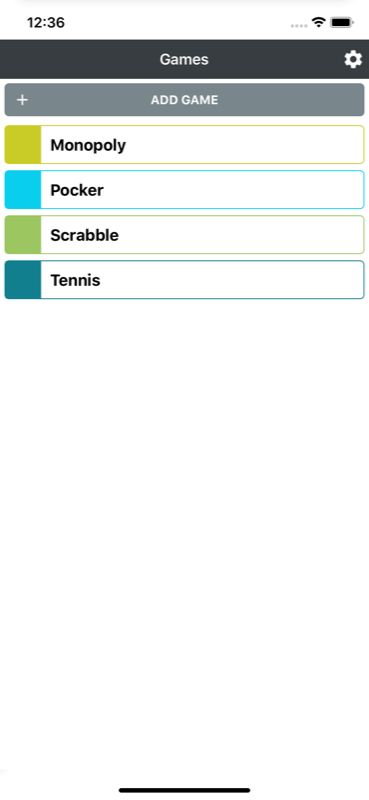
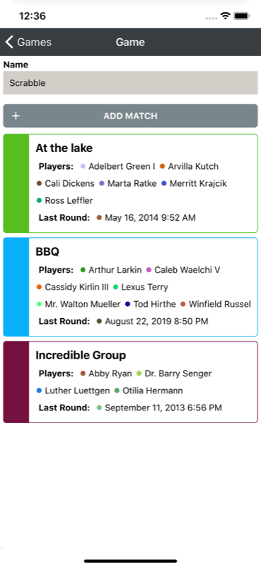
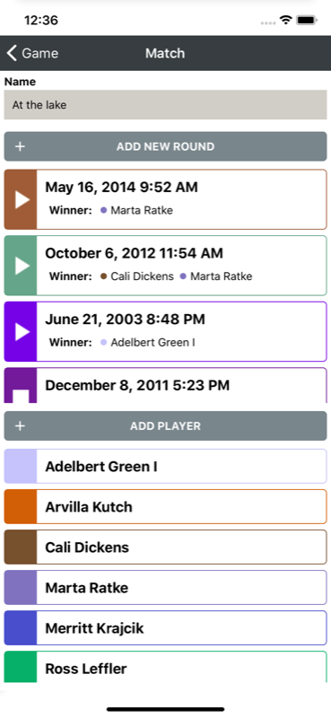
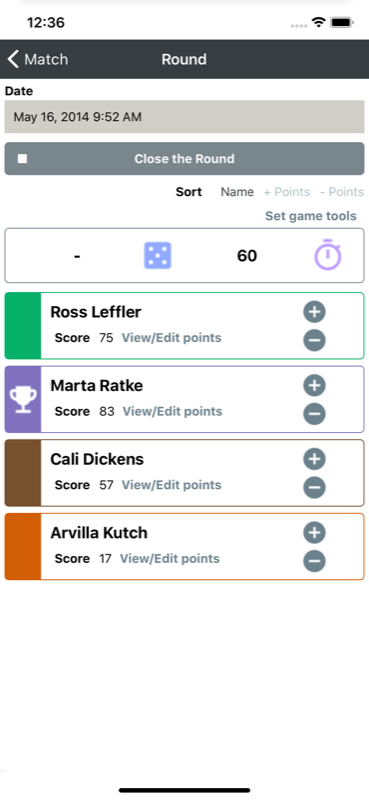
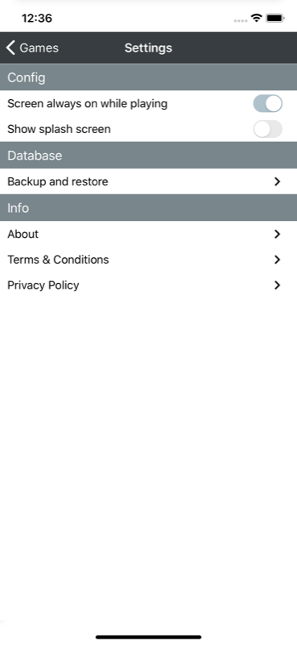

About
===

**[My Score Keeper](https://github.com/davidegironi/myscorekeeper)** is a **simple app that allows your track score of your games**.  
You can add multiple Games, each games may have many Match and each match many Rounds. You can add as much Players as you need.
Points are recorded so you can take a look at the full historical points list.  
A Dice tool and the Countdown Timer are also included. Just tap on the dice to generate a random number, or use the Countdown Timer to time your Round.
The free Backup and Restore cloud agent allows your data to be upload on a temporary cloud space you can use to restore to another device just in case.
My Score Keeper is Open Source, and it's built using [React Native](https://reactnative.dev/).

## Download
* **Google Play Store** ...link to come
* **App Store** I don't have an Apple Developer Account, donations are welcome.

## Screenshot

## Requirements
* Android minSdkVersion = 16
* iOS Deployment Target = 9.0

## Development

If you want to contribute, or you found a bug, please send an e-mail to the software author.

## License

Copyright (c) Davide Gironi, 2020.  
My Score Keeper is an open source software licensed under the [GPLv3 license](http://opensource.org/licenses/GPL-3.0)